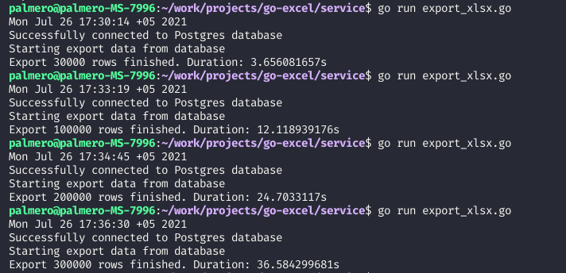
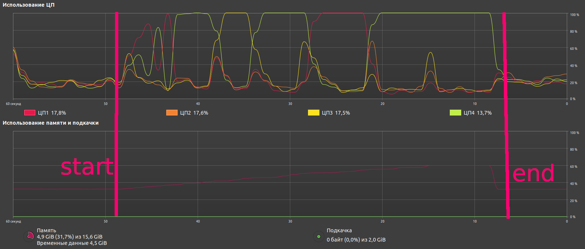
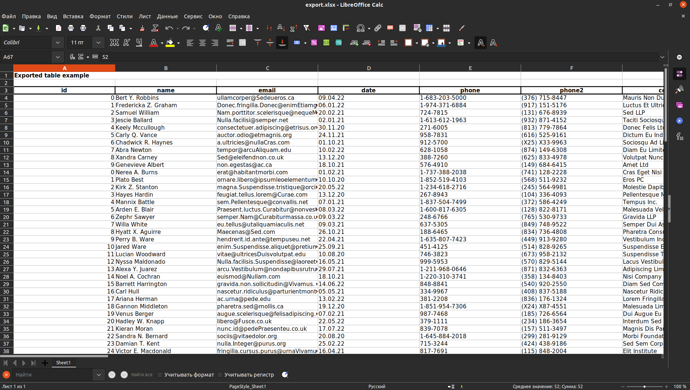

# Go excel

## Just for tests golang and xlsx export performance

### Results


### Benchmark
CPU: Intel Core i5-6400 @ 4x 3,3GHz
RAM: LPX 8GB (2 x 8GB) DDR4 DRAM 2400MHz C16


### Exported xlsx file


### Some commands
Create database first:
```bash
create database go_excel;
```

Create table and fill test data
```bash
psql -U <user> -d go_excel -f create_database.sql
```

Connect database
```bash
\c go_excel
```

Check rows count
```sql
select count(*) from import_table;
```